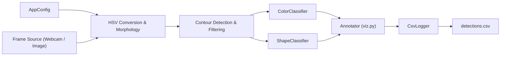

# Shape & Color Vision

Dieses Projekt verwendet Methoden der **Computer Vision**, um einfache geometrische Formen  
(z. B. Kreis, Quadrat, Dreieck, Rechteck) und **Farben** (Rot, Grün, Blau, Gelb, Violett usw.) automatisch zu erkennen.  
Es kann sowohl auf **Einzelbildern** als auch auf **Live-Kamera-Streams** (z. B. einer Webcam) ausgeführt werden.

## Inhaltsverzeichnis
1. [Projektübersicht](#-projektübersicht)
2. [Projektstruktur](#-projektstruktur)
3. [Installation und Ausführung](#️-installation-und-ausführung)
4. [Funktionsweise](#-funktionsweise)
5. [Modulübersicht](#-modulübersicht)
6. [Beispielausgabe](#-beispielausgabe)
7. [Entwicklerhinweise](#-entwicklerhinweise)

## Projektübersicht

Das System analysiert ein Bild oder Videoframes, erkennt Objekte anhand ihrer **Form und Farbe**,  
beschriftet diese visuell im Bild und protokolliert die Ergebnisse in einer **CSV-Datei**.

### Ablauf der Verarbeitung
1. **Maskenerstellung** im HSV-Farbraum basierend auf Sättigungs- und Helligkeitsschwellen.
2. **Konturerkennung** und Filterung nach geometrischen Kriterien.
3. Für jeden gefundenen Kontur:
   - Farbanalyse mittels medianer HSV-Werte (`colors.py`)
   - Formklassifizierung mittels Konturmetrik (`shapes.py`)
4. Ausgabe der Ergebnisse im Bild (mit Textlabel).
5. Protokollierung der Erkennung in einer CSV-Datei (`logs/detections.csv`).

## Projektstruktur

```
shape_color_vision/
│
├── main.py               # CLI (Kommandozeilenanwendung)
├── pipeline.py           # Verarbeitungs-Pipeline
│
├── colors.py             # Farbklassifikation (HSV-basiert)
├── shapes.py             # Formklassifikation (Konturbasiert)
├── logger_csv.py         # CSV-Logger für Erkennungsergebnisse
├── viz.py                # Visualisierung (Label, Konturen)
├── config.py             # YAML-Konfiguration laden
├── __init__.py           # Paketinformationen (__version__, __app_name__)
│
├── data/
│   ├── samples/          # Beispielbilder
│   └── output/           # Annotierte Ausgabebilder
│
└── logs/
    └── detections.csv    # CSV-Protokoll
```

## Installation und Ausführung

### Abhängigkeiten installieren
```bash
pip install -r requirements.txt
```

**Minimale Pakete:**
```bash
opencv-python
numpy
typer
pyyaml
```
### Programm starten

#### Analyse eines Bildverzeichnisses:
```bash
python -m shape_color_vision.main image --config configs/default.yaml --save-output
```

#### Analyse mit der Webcam:
```bash
python -m shape_color_vision.main camera --config configs/default.yaml
```

> Drücke **q**, um die Live-Ansicht zu beenden.

## Funktionsweise

1. Laden der Parameter aus der Konfigurationsdatei (`default.yaml`),  
   z. B. Mindestfläche, Sättigungs-/Helligkeitsschwellen, Speicherpfade.
2. Umwandlung des Bildes in den **HSV-Farbraum**.
3. Anwendung von Morphologie-Operationen zur Maskierung der relevanten Bereiche.
4. Analyse jedes Konturs:
   - `classify_color()` → Farbe
   - `classify_shape()` → Geometrische Form
5. Ausgabe der beschrifteten Ergebnisse auf dem Bildschirm und Speicherung im CSV-Log.

## Modulübersicht

| Modul | Beschreibung |
|-------|---------------|
| **`colors.py`** | Robuste Farbklassifikation auf Basis der Median-Hue-Werte. Unklare Bereiche (z. B. Orange, Magenta) werden als *unknown* markiert. |
| **`shapes.py`** | Bestimmung geometrischer Formen über Umfang, Eckenanzahl, Achsenverhältnis und Rundheit. |
| **`logger_csv.py`** | Schreibt jede Erkennung mit Zeitstempel, Form, Farbe und Konfidenz in eine CSV-Datei. |
| **`viz.py`** | Zeichnet Labels und Konturen auf das Bild. |
| **`config.py`** | Liest YAML-Konfigurationsdateien und erstellt ein `AppConfig`-Objekt. |
| **`pipeline.py`** | Hauptlogik: Erkennung, Klassifikation und Logging. |
| **`main.py`** | CLI mit Befehlen `image` und `camera` über das `typer`-Framework. |

## Beispielausgabe (CSV-Log)

| timestamp | shape | color | confidence | source | name |
|------------|--------|--------|-------------|---------|--------|
| 2025-10-24T14:30:01 | Circle | red | 0.95 | IMAGE | ball.png |
| 2025-10-24T14:31:11 | Square | blue | 0.88 | CAMERA | webcam |

## Entwicklerhinweise

- **Farbraum:** Alle Berechnungen erfolgen im HSV-Raum (`cv2.cvtColor(BGR → HSV)`).
- **Formmetrik:** Kombination aus *Circularity*, *Solidity* und *Aspect Ratio* zur präzisen Trennung von Kreis, Rechteck und Polygon.
- **"Unknown"-Klasse:** Wird bei geringer Sättigung oder mehrdeutigen Tönen vergeben.
- **Codequalität:** Der gesamte Code ist nach **PEP8**, mit **Type Hints** und klarer Modulstruktur geschrieben.
- **Optimierung:** Für Raspberry Pi oder eingebettete Systeme leicht anpassbar.
- **Logging:** CSV-Dateien werden automatisch erstellt, wenn sie nicht existieren.

## Lizenz

Dieses Projekt wurde zu Lern- und Forschungszwecken entwickelt.  
Die Verwendung ist frei, solange der ursprüngliche Autor genannt wird.

---

**Autor:** Morad Younis & Emrah Tekin  
**Version:** 0.1.0  
**FHGR – Photonics Engineering / Prototyping Modul**


## C4 Model ##

1.) Context Diagramm 
//=====================
graph LR
    User([User])
    subgraph External
        Camera[[Webcam]]
        ImgFolder[[Image Folder]]
        FileSystem[(File System / CSV Logs)]
        Libs[(OpenCV, NumPy, Typer, PyYAML)]
    end

    App[Shape & Color Vision Application]

    User -->|CLI commands| App
    Camera -->|Live video stream| App
    ImgFolder -->|Image files| App
    App -->|detections.csv| FileSystem
    App -.->|uses| Libs
//=============================

2.) Container Diagramm
graph TB
    subgraph "CLI Application (Python 3.x, Typer)"
        Main["main.py (CLI Entry Point)"]
        Pipeline["pipeline.py (Main Pipeline)"]
        Color["colors.py (Color Detection)"]
        Shape["shapes.py (Shape Detection)"]
        Viz["viz.py (Visualization)"]
        Log["logger_csv.py (CSV Logger)"]
        Cfg["config.py (YAML Loader)"]
    end

    Cam[[Webcam]]
    Img[[Image Folder]]
    CSV[(logs/detections.csv)]
    YAML[[configs/*.yaml]]

    Main --> Pipeline
    Main --> Cfg
    Cfg --> YAML

    Pipeline --> Color
    Pipeline --> Shape
    Pipeline --> Viz
    Pipeline --> Log
    Pipeline --> Cam
    Pipeline --> Img
    Log --> CSV


3.) Component Diagramm



4.) Code Diagramm:

classDiagram
    class Pipeline {
        +run(mode, config)
        -process_frame(frame): Detection[]
    }

    class ColorClassifier {
        +classify(hsvRegion): ColorLabel
    }

    class ShapeClassifier {
        +classify(contour): ShapeLabel
    }

    class CsvLogger {
        +append(timestamp, shape, color, confidence, source, filename)
    }

    class Annotator {
        +draw(frame, detections): frame
    }

    Pipeline --> ColorClassifier
    Pipeline --> ShapeClassifier
    Pipeline --> CsvLogger
    Pipeline --> Annotator
